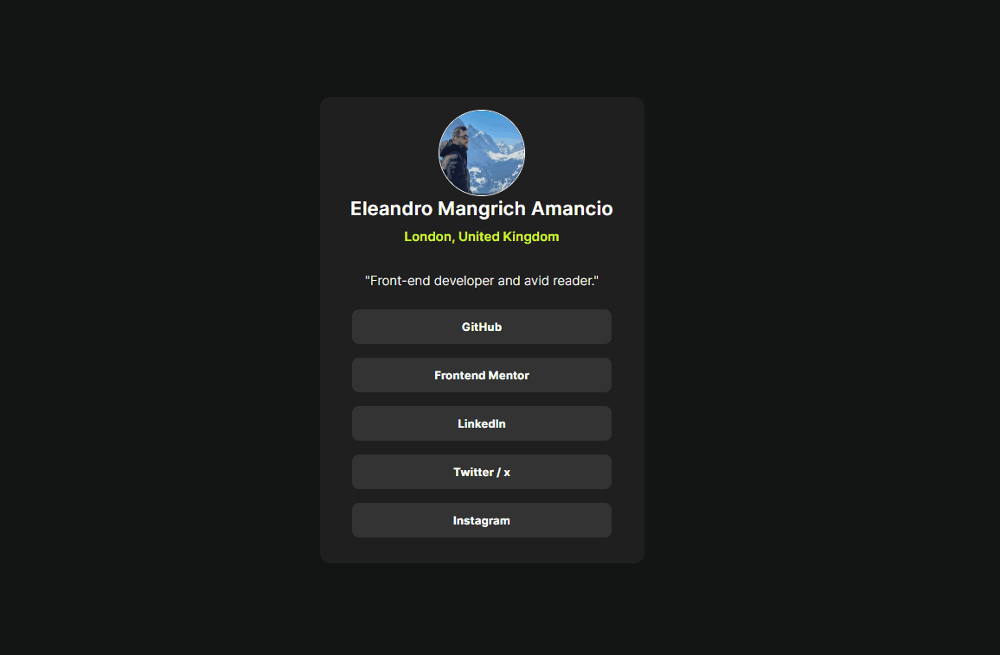

# Frontend Mentor - Social Links Profile Solution

This is a solution to the [Social Links Profile challenge on Frontend Mentor](https://www.frontendmentor.io/challenges/social-links-profile-UG32l9m6dQ). Frontend Mentor challenges help developers improve their coding skills by building realistic projects.

---

## Table of contents

- [Overview](#overview)
  - [The challenge](#the-challenge)
  - [Screenshot](#screenshot)
  - [Links](#links)
- [My process](#my-process)
  - [Built with](#built-with)
  - [What I learned](#what-i-learned)
  - [Continued development](#continued-development)
  - [Useful resources](#useful-resources)
- [Author](#author)

---

## Overview

### The challenge

Users should be able to:

- See hover and focus states for all interactive elements on the page.
- Click buttons to be redirected to the respective social media profiles.

### Screenshot



### Links

- **Solution URL**: [GitHub Repository](https://github.com/Eleandro1302)
- **Live Site URL**: [Live Demo](https://eleandro-social-links-profile.netlify.app)

---

## My process

### Built with

- Semantic HTML5 markup
- CSS custom properties
- Flexbox
- CSS Grid
- Mobile-first workflow
- JavaScript for button redirection

### What I learned

This project helped me improve my understanding of responsive design, CSS Grid, and JavaScript for handling button interactions. Below is an example of a JavaScript snippet I used:

```javascript
<button class="btn" onclick="window.open('https://github.com/Eleandro1302', '_blank')">GitHub</button>
```

### Continued development

In future projects, I plan to focus on:

- Enhancing JavaScript interactivity.
- Exploring advanced CSS animations and transitions.
- Improving accessibility and performance optimization.

### Useful resources

- [CSS Tricks - A Complete Guide to Grid](https://css-tricks.com/snippets/css/complete-guide-grid/) - This guide helped me understand CSS Grid better.
- [MDN Web Docs - Responsive Design](https://developer.mozilla.org/en-US/docs/Learn/CSS/CSS_layout/Responsive_Design) - A great resource for learning responsive design principles.

---

## Author

- **Name**: Eleandro  
- **LinkedIn**: [linkedin.com/in/eleandro-mangrich](https://linkedin.com/in/eleandro-mangrich)  
- **Frontend Mentor**: [@Eleandro](https://www.frontendmentor.io/profile/Eleandro1302)
- **Email**: eleandro@gmail.com

---

## Tradução para Português

# Frontend Mentor - Solução do Perfil de Links Sociais

Esta é uma solução para o [desafio Perfil de Links Sociais no Frontend Mentor](https://www.frontendmentor.io/challenges/social-links-profile-UG32l9m6dQ). Os desafios do Frontend Mentor ajudam os desenvolvedores a melhorar suas habilidades de codificação construindo projetos realistas.

---

## Tabela de Conteúdos

- [Visão Geral](#visão-geral)
  - [O Desafio](#o-desafio)
  - [Captura de Tela](#captura-de-tela)
  - [Links](#links)
- [Meu Processo](#meu-processo)
  - [Construído com](#construído-com)
  - [O que Aprendi](#o-que-aprendi)
  - [Desenvolvimento Contínuo](#desenvolvimento-contínuo)
  - [Recursos Úteis](#recursos-úteis)
- [Autor](#autor)

---

## Visão Geral

### O Desafio

Os usuários devem ser capazes de:

- Ver estados de foco e hover para todos os elementos interativos na página.
- Clicar nos botões para serem redirecionados aos respectivos perfis de redes sociais.

### Captura de Tela


### Links

- **URL da Solução**: [Repositório no GitHub](https://github.com/Eleandro1302)
- **URL do Site ao Vivo**: [Demonstração ao Vivo](https://eleandro-social-links-profile.netlify.app)

---

## Meu Processo

### Construído com

- Marcação HTML5 semântica
- Propriedades personalizadas de CSS
- Flexbox
- CSS Grid
- Fluxo de trabalho mobile-first
- JavaScript para redirecionamento de botões

### O que Aprendi

Este projeto me ajudou a melhorar minha compreensão sobre design responsivo, CSS Grid e JavaScript para lidar com interações de botões. Abaixo está um exemplo de snippet de JavaScript que usei:

```javascript
<button class="btn" onclick="window.open('https://github.com/Eleandro1302', '_blank')">GitHub</button>
```

### Desenvolvimento Contínuo

Em projetos futuros, pretendo focar em:

- Aprimorar a interatividade com JavaScript.
- Explorar animações e transições avançadas em CSS.
- Melhorar a acessibilidade e otimização de desempenho.

### Recursos Úteis

- [CSS Tricks - Um Guia Completo para Grid](https://css-tricks.com/snippets/css/complete-guide-grid/) - Este guia me ajudou a entender melhor o CSS Grid.
- [MDN Web Docs - Design Responsivo](https://developer.mozilla.org/pt-BR/docs/Learn/CSS/CSS_layout/Responsive_Design) - Um ótimo recurso para aprender os princípios de design responsivo.

---

## Autor

- **Nome**: Eleandro  
- **LinkedIn**: [linkedin.com/in/eleandro-mangrich](https://linkedin.com/in/eleandro-mangrich)  
- **Frontend Mentor**: [@Eleandro](https://www.frontendmentor.io/profile/Eleandro1302)
- **Email**: eleandro@gmail.com
